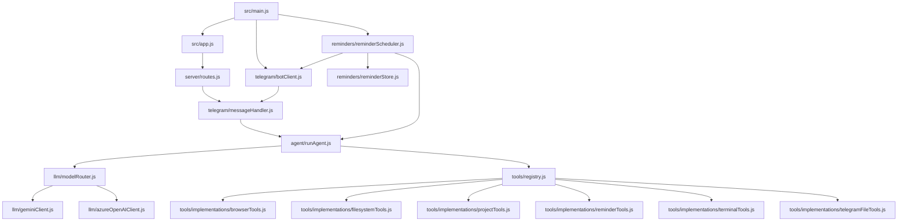

# Architecture

The assistant is organized around four runtime boundaries:

1. Telegram receives a user message through polling or the webhook route.
2. The agent runner selects the configured provider and prepares tool access for the chat.
3. The LLM client executes a provider-specific tool loop.
4. Tool implementations perform local filesystem, project workflow, scheduling, terminal, managed browser, or Telegram file-send side effects.
5. The reminder scheduler restores local scheduled tasks on startup and sends due Telegram notifications or scheduled agent results.

The tool registry is the main safety boundary. Any new capability that touches the local machine should be added under `src/tools/implementations/` and exposed through `src/tools/registry.js`.

Scheduled reminders and agent tasks are stored in `.data/scheduled-tasks.json`. The scheduler uses this local store to recover pending tasks after restart, but tasks can only run while the Node process is active.
